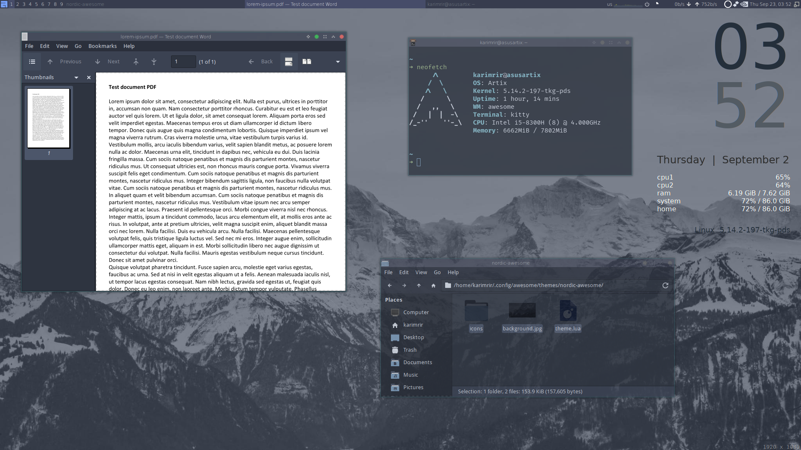

# nordic-awesome
AwesomeWM theme based on the awesome nordic color scheme

### Notice
This theme has been forked from the awesome-macos theme https://github.com/dj95/awesome-macos, All the icons and the original source code are not owned by me. I only changed the color scheme of the theme

### Installation
Change directory to your awesomewm themes folder
```
cd ~/.config/awesome/themes
```
If the folder does not exist then you can create it
```
mkdir ~/.config/awesome/themes
```
Git clone the repository into your awesome themes folder
```
git clone https://github.com/karimrir1/nordic-awesome.git
```
Go into your rc.lua and point it to the theme.lua
```
beautiful.init(os.getenv("HOME") .. "/.config/awesome/themes/nordic-awesome/theme.lua")
```

### Screenshot

